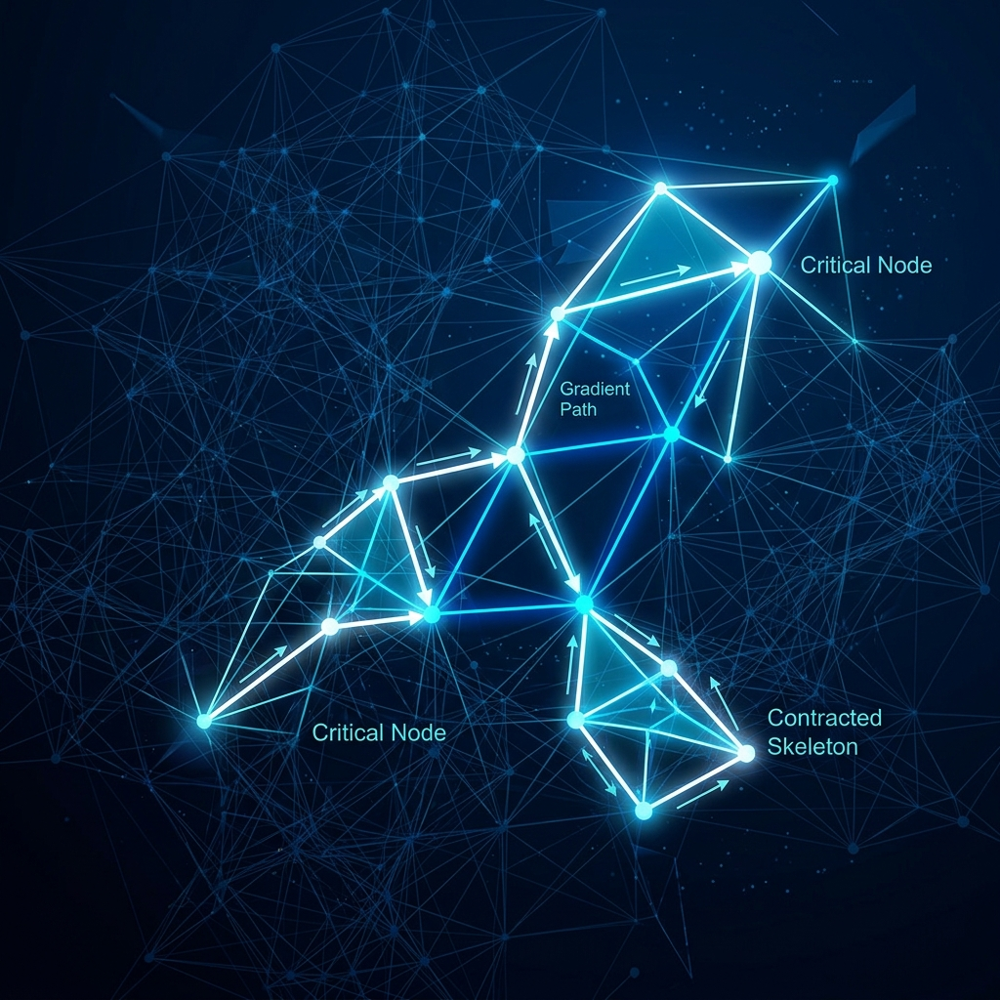
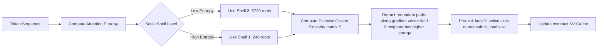

# QAN for Humans: A Conceptual Guide to Project Atlas

Welcome to the accessible overview of **Project Atlas (QAN-ATLAS)**. If you want to understand the core concepts behind this framework without drowning in matrix calculus, coordinate systems, or multi-dimensional geometry, you are in the right place. 

We write this with absolute honesty: we will explain what this system does, how it works using simple analogies, and—critically—what its trade-offs and limitations are. No hype, no buzzwords. Just math and some dry humor.

---

## 1. The Core Problem: The Memory Cliff

Standard deep learning models (like GPT-4 or Gemma) have a major memory flaw: **as the text sequence gets longer, the memory required to remember it (the Key-Value or KV Cache) grows quadratically or linearly.** 
If you try to feed a model a whole book (200,000 words), it eventually hits a "memory cliff"—either running out of GPU VRAM (crashing with an Out of Memory error) or slowing down to a crawl.

Project Atlas solves this by replacing continuous memory with **discrete topological spaces**. In plain English: we compress and index memory so that the model only remembers unique semantic concepts, rather than every word in order.

---

## 2. Analogy 1: Concentric Shell Mapping (The Subway System)
*   **The Math Jargon**: Concentric Icosian Shell Mapping ($E_8$ Attention)
*   **The Analogy**: A city's subway system with express and local lanes.

Imagine you are planning a trip across a massive metropolis. You don't walk down every single street block-by-block. Instead, you walk to the nearest local subway station, catch an express train to a major hub, and then take a local line to your final destination.

In standard attention, every word has to talk to every other word (like walking block-by-block). In Project Atlas, we map all possible words to a predefined set of **240 coordinates** in a discrete geometry (the $E_8$ lattice). These 240 coordinates are organized into **5 concentric shells** (like zones on a subway map). 
*   **Shell 0 (Hubs)**: The central downtown stations.
*   **Shells 1-4 (Local zones)**: Outlying neighborhoods.

Tokens (words) query this coordinate system. Instead of talking to all 200,000 previous tokens, they only talk to the active coordinate zones. Geodesic distances across these shells act as **logarithmic jumping highways**, allowing words to bypass long sequences of text and jump directly to relevant ideas.

---

## 3. Analogy 2: p-Adic Coordinate Routing (The Hierarchical ZIP Code)
*   **The Math Jargon**: $p$-adic Tree Coordinate Routing (Ultrametric Cognitive Engine - UCE)
*   **The Analogy**: A postal sorting center using hierarchical zip codes.

While QAN maps memory coordinates to the 8D $E_8$ lattice, searching through thousands of coordinate points in real-time can still be slow. The **Ultrametric Cognitive Engine (UCE)** solves this by overlaying a hierarchical, tree-like structure (a $p$-adic tree) over the $E_8$ coordinate space.

Imagine you want to send a letter to a house in a city. You don't read every house number in the city directory. You read the ZIP code: first the state, then the city, then the neighborhood, then the street. 

UCE acts as the routing system:
1.  **Continuous to Tree Coordinates**: It projects words into continuous 3D coordinates and extracts digits using three number bases (2, 3, and 5—which represent the prime factors of 30, matching icosahedral projection symmetry).
2.  **Morton Coding**: It interleaves these base-2, base-3, and base-5 digits to build a unique "semantic ZIP code" (a Morton code) representing the word's position in a tree hierarchy.
3.  **Fast Tree Search & Assembly**: In long contexts, instead of scanning all database memories, UCE routes searches down this tree. It prunes out entire branches (using 2-adic coset matching in the `AdelicMemorySwapGridDB` database) to locate the exact $E_8$ coordinate neighbor in logarithmic time. In addition, when computing attention over sequence lengths greater than 2048, it sorts and aggregates tokens within this tree using a tree-structured Fast Multipole Method (FMM), preventing quadratic memory bottlenecks.

---

## 4. Analogy 3: Morse Cache Contraction (The Spiderweb)
*   **The Math Jargon**: Discrete Morse Theory Retraction
*   **The Analogy**: Pruning a spiderweb to its main structural hubs.

Imagine a spiderweb wet with dew. There are thousands of tiny, intersecting silk threads. If you want to know the shape of the web, you don't need to trace all ten thousand intersections. You only need to look at the primary radial lines that anchor the web to the branches. If you throw away the minor threads, the web still holds its shape.

In Project Atlas, the KV cache (the model's memory of past text) is treated like a complex geometric shape. **Discrete Morse Contraction** works by mathematically collapsing redundant attention paths down to a critical "skeleton." It prunes away the duplicate or semantically empty threads, compressing the memory footprint by **85% or more** at long contexts, without losing the core structure of the conversation.

### Morse KV Cache Contraction Flow

---

## 5. Analogy 4: Čech Cohomology Firewall (The Structural Health Sensor)
*   **The Math Jargon**: Čech Cohomology Obstruction & Fiedler Vector Bisection
*   **The Analogy**: A structural health sensor on a suspension bridge.

When a suspension bridge is under normal load, the tension across its cables is distributed smoothly. If a cable snaps or an earthquake hits, the tension spikes violently at the fracture point. A sensor detects this drop in structural integrity and halts traffic immediately.

In Project Atlas, we treat the attention matrix (the connection between words) as a geometric bridge. The **Čech Cohomology Firewall** monitors this bridge during the forward pass. 
*   **Normal Input**: The mathematical "tension" is stable.
*   **Hallucinations or Adversarial Steering Attacks**: The attention structure fractures, causing a sudden drop in algebraic connectivity.
*   **The Rollback**: When a fracture is detected, the firewall uses **Fiedler bisection** (a graph partitioning technique) to pinpoint the exact word that caused the split. It then rolls back the generation and routes traffic along a different, more stable semantic path.

---

## 6. Analogy 5: Multi-Agent Concurrency & Relocation (The Sandbox & Parking Lot)
*   **The Math Jargon**: Copy-on-Write (CoW) branching and Topological Relocation
*   **The Analogy**: Designing in separate sandboxes, then merging cars into a parking lot.

When multiple AI agents work on the same model memory concurrently, they might try to write updates to the exact same memory cell.
1.  **Copy-on-Write (CoW)**: Each agent gets its own local clone (a sandbox) to perform speculative updates. This prevents them from stepping on each other's toes.
2.  **Topological Relocation**: When they merge their sandboxes back into the main memory grid, we might get a collision (two agents trying to park their data at the exact same coordinate). Averaging the data creates a blurry hybrid (a "hallucination vector"). Instead, we treat the coordinate system like a **parking lot**: we nudge the second agent's data to the **nearest empty parking spot** in the E8 neighborhood (which has 240 immediate neighbor spots). This preserves both agents' data cleanly.

---

## 7. Honest Limitations & Trade-offs

We do not believe in magic. Project Atlas achieves its massive memory savings by making specific technical trade-offs:

1.  **Lossy Compression**: Projecting high-dimensional word representations onto a discrete 240-coordinate grid is fundamentally lossy. For standard prose, code, and conversation, it works beautifully. However, for highly chaotic, randomized, or extremely dense inputs, it may experience minor semantic recall loss.
2.  **MLX SVD Hardware Constraints**: In the Apple MLX backend, Singular Value Decomposition (SVD) and QR decomposition are not supported on the GPU. We solve this by running these operations in NumPy on the CPU, then casting them back. While this avoids crashes, it introduces a microscopic CPU-GPU transfer overhead during model initialization.
3.  **Local Filesystem Dependency**: The thread-safe file mutex utilizes standard Unix `fcntl.flock` locks. This works flawlessly on local drives (like your Mac SSD), but will fail or block indefinitely if the project directory is hosted on certain network drives (like NFS or virtual filesystems) that do not support flock.
4.  **RAG is Syntactic**: The built-in Lattice RAG indexes documents by chunking and projecting them using n-gram coordinates. It does not use a deep neural embedding model. It is extremely fast and zero-cost, but it is a syntactic nearest-neighbor lookup rather than a deep conceptual semantic search.

---

## 8. Performance & Comparison Whitepaper

For a detailed comparative breakdown utilizing real logged data from our Apple Silicon M4 Pro benchmarking runs (including memory footprint comparisons up to 500k context lengths and speculative decoding speeds), please see [Project Atlas Performance Whitepaper](file:///Volumes/Storage/project_atlas_moonshot/docs/project_atlas_whitepaper.md).

