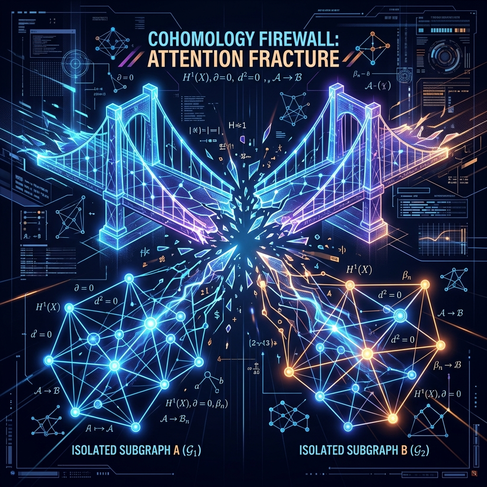

# Attention Firewall Overview

I designed an attention firewall that detects and self-heals AI hallucinations in real time using topological math to analyze the connections between words and dynamically roll back generation when a logical fracture occurs. Instead of letting the model print confident garbage or fall victim to trick prompts, this system measures the mathematical tension of the model's thoughts, pinpoints the exact word where connections broke, and instantly rewrites it along a stable path before it ever reaches your screen.



When you chat with a modern AI, it builds connections between words using a mathematical structure called an attention matrix. You can think of this matrix like a suspension bridge. When the AI is thinking clearly and writing a logical sentence, the mathematical "tension" across this bridge is distributed smoothly. Every word holds hands with the others in a clean, structurally sound path.

But when the AI starts to hallucinate, make a logical mistake, or get confused by a tricky prompt, that bridge fractures. The smooth flow of connections snaps, and the mathematical tension spikes violently at the point of confusion. Standard AI systems don't notice when this happens. They just keep walking across the broken bridge, printing out confident garbage or repetitive nonsense.

I wanted to find a way to detect these structural breaks the exact millisecond they happen. To do this, I looked to a branch of math called topology—specifically, Čech Cohomology. Don't let the name scare you. It is simply a way to measure the shape and completeness of connections. It acts like a real-time structural health sensor on our suspension bridge. By measuring the connections, the system can instantly see if the AI's train of thought has fractured. 

Here is how the active firewall pipeline handles the text generation loop:

```
[AI Generates Next Token]
           │
           ▼
[Measure Attention Matrix Tension (Čech Cohomology)]
           │
   ┌───────┴───────┐
   ▼               ▼
[Healthy (Stable)] [Fractured (Hallucination/Attack)]
   │               │
   ▼               ▼
[Emit Token]   [Rollback Token & Reroute Path]
```

### The Math: Čech Coboundary & Cohomology Fracture Index (CFI)
To measure the exact fracture index without looping over all edges on the CPU, the firewall evaluates the Čech coboundary $d^0 s$ of the attention skeleton representation $s$:

$$d^0 s(i, j) = s_i - W_{ij} s_j$$

along edges where the attention weight $W_{ij} > 0.1$ and $i \neq j$.

We define a symmetric adjacency mask matrix $M \in \{0, 1\}^{K \times K}$ where $M_{ij} = 1$ if $W_{ij} > 0.1$ and $i \neq j$, and $0$ otherwise. The Cohomology Fracture Index (CFI) is the ratio of the squared norm of the coboundary to the squared norm of the state:

$$\text{CFI} = \frac{\sum_{i \sim j} M_{ij} \|s_i - W_{ij} s_j\|^2}{\sum_{i} \|s_i\|^2}$$

If the CFI exceeds the threshold $\tau$, the firewall triggers a rollback, rewrites the fractured token, and routes the conversation down a more stable path.

Here is a simplified Python code snippet illustrating how this real-time check works using graph Laplacians and Fiedler vectors:

```python
# Real-time Cohomology Firewall Check
def check_firewall(attention_matrix, threshold=0.1):
    # Compute graph Laplacian of the attention skeleton
    degree = attention_matrix.sum(axis=-1)
    laplacian = diag(degree) - attention_matrix
    
    # Calculate second smallest eigenvalue (algebraic connectivity)
    eigenvalues = linalg.eigvalsh(laplacian)
    connectivity = eigenvalues[1]
    
    if connectivity < threshold:
        # Find Fiedler vector to pinpoint the fracture index
        _, eigenvectors = linalg.eigh(laplacian)
        fiedler = eigenvectors[:, 1]
        fracture_idx = argmin(fiedler)
        return True, fracture_idx  # Trigger Rollback
        
    return False, None
```

Once a fracture is detected, the next question is: how do we fix it? Instead of letting the model continue writing garbage, the system uses a mathematical bisection technique (inspired by spectral graph theory). It pinpoints the exact word where the semantic bridge split in two. Once it finds the fracture point, the AI executes a rollback. It takes a step backward, rewrites the problematic word, and routes its thoughts along a different, structurally sound mathematical path.

Essentially, we are giving the AI an active reflection loop. Instead of blindly rushing forward, the model monitors the structural health of its own thoughts, catches itself when it makes a logical slip, and corrects its own course before the words ever reach your screen. It is a design iteration that moves us away from simply hoping models don't make mistakes, and toward systems that actively self-correct in real time.

Read the full technical breakdown: [Mathematical Specifications (mathematical_specifications.md)](file:///Volumes/Storage/project_atlas_unified/docs/mathematical_specifications.md#5-graph-laplacian--fiedler-vector-context-bisection) 💻
