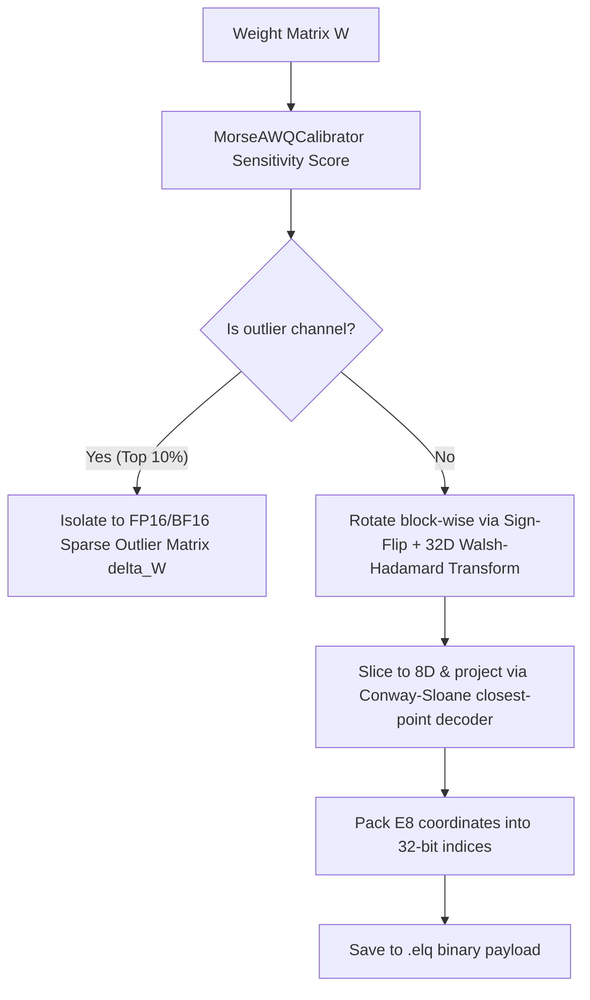
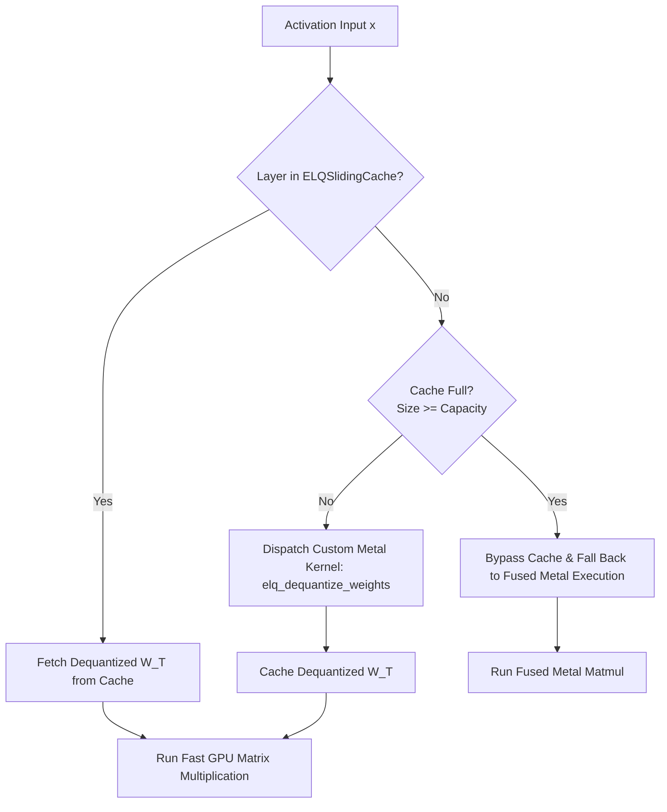

# Deep Dive: Embedding Lattice Quantization (ELQ)

## 1. The Core Problem: Why Standard 4-bit Quantization Degrades LLMs
Standard 4-bit quantization methods (like uniform integer quantization in GGUF or weight-only AWQ) scale and quantize all weights uniformly. However, LLMs contain **outlier activations**—sparse, high-magnitude channels that carry critical reasoning and syntactic information. 
When these outliers are quantized into a tight 4-bit range, their values are clipped or heavily rounded, causing severe accuracy collapse (word salad, syntax breakdown in regex, etc.). Basically, the model's brain gets bruised by rounding errors.

---

## 2. The ELQ Solution: Split-Coordinate Quantization
Embedding Lattice Quantization (ELQ) solves this by splitting the weight matrix $W$ into a dense quantized matrix and a sparse outlier correction matrix:

$$
W = \text{Dequant}(W_{\text{quant}}) + \Delta W_{\text{outliers}}
$$

### ELQ Quantization Pipeline

### How ELQ Splits the Weights
Quantizing an LLM without breaking its brain is a delicate art. ELQ does this in a few systematic steps:
1. **Outlier Identification**: First, we use `MorseAWQCalibrator` to evaluate the weight matrix and activation distributions. It calculates a sensitivity score for each channel (using the AWQ metric: $s_c = \text{mean}(|X_c|) \times \Vert W_c\Vert _2$). The top outlier channels (e.g., 10%) are flagged.
2. **Outlier Isolation**: The high-magnitude weights in these outlier channels are extracted into a coordinate-sparse matrix $\Delta W_{\text{outliers}}$. These precious outliers are stored in their native precision (float16/bfloat16) to avoid any clipping or rounding degradation.
3. **Lattice Projection**: The remaining non-outlier weights (with outlier channels zeroed out) are rotated block-by-block (using blocks of size 32) via a deterministic sign-flip and a Walsh-Hadamard Transform (WHT). This mathematical "spin cycle" distributes coordinate energy evenly, preventing any single dimension from hogging the dynamic range.
4. **E8 Encoding**: The rotated 32D blocks are sliced into 8-dimensional sub-vectors and projected onto the closest point in the 8D $E_8$ lattice using the Conway-Sloane closest-point algorithm. The resulting coordinates are packed into a tidy 32-bit index.

### Under the Hood: The Parameters
In `qan_transformers/mlx/modeling.py`, an `ELQLinear` layer stores:
1.  `self._indices`: 4-bit quantized indices mapping weights onto E8 coordinate lattices.
2.  `self._scales`: Block-wise scaling factors to decompress the indices.
3.  `self._outliers` & `self._outlier_indices`: A coordinate-sparse matrix containing the exact, unquantized values of high-magnitude outlier weights.

---

## 3. The ELQ Sliding Cache (`ELQSlidingCache`)
Instead of keeping the entire model decompressed in RAM (which would exceed Macbook memory boundaries) or dequantizing weights on *every single forward pass* (which introduces heavy GPU dispatch overhead), ELQ utilizes a **sliding cache gateway**:

### The Entropy-Driven Sliding LRU Cache
*   The `ELQSlidingCache` manages a dynamic capacity cache (evicting the oldest entries using a true LRU scheme upon cache miss).
*   **Dynamic Capacity Gating**: To balance speed and VRAM footprint, cache capacity dynamically scales in response to sequence-level attention entropy. In low-entropy (highly certain) regimes, the cache capacity scales down (releasing VRAM and falling back to JIT execution). In high-entropy (uncertain/firewall-triggered) regimes, the capacity scales up to lock unquantized weights in VRAM for maximum speed.
*   **JIT Stability and Cache Padding**: To prevent JIT recompilations and shape broadcast failures during dynamic eviction and speculative generation, the KV cache keys and values are pre-padded to multiples of 256. Enforcing a global `in_jit = True` state during speculative cycles ensures the target and draft models sync to standard JIT memory buffers rather than conflicting with stale cache entries.

---

## 4. Fused Metal Matmul Fallback
When the cache is globally bypassed (e.g., during fast draft steps where compiling/caching is not worth the latency) or when the cache is at capacity, `ELQLinear` falls back to **fused Metal execution**:

$$
\text{Out} = \text{elq\_fused\_matmul}(x, \text{indices}, \text{scales}) + x_{\text{outliers}} \Delta W_{\text{outliers, active}}^T
$$

### The Fused Advantage
*   `elq_fused_matmul` performs the **dequantization and matrix multiplication in a single GPU kernel dispatch pass**.
*   It decodes the 4-bit weights on the fly inside the GPU register file *during* the multiplication, completely avoiding allocating a large temporary float32 weight matrix in RAM.
*   Outliers are added as a residual step: the input vector $x$ is sliced at the outlier coordinates ($x_{\text{outliers}}$), multiplied by the active sparse outliers matrix ($\Delta W_{\text{outliers, active}}^T$), and added to the output.

---

## 5. Technical Comparison: ELQ vs. Standard Quantization

| Spec | Standard GGUF / AWQ | ELQ (Embedding Lattice Quantization) |
| :--- | :--- | :--- |
| **Quantization Logic** | Uniform integer scaling across blocks. | Split-coordinate projection: E8-mapped indices + sparse outliers. |
| **Outlier Handling** | Clipped or rounded, causing accuracy drift. | Retained in native precision (fp16/bf16), preserving baseline accuracy. |
| **Memory Allocation** | Decompresses weights per forward pass or locks all in VRAM. | Pre-grafted or first-come-first-served static cache up to capacity. |
| **Metal Dispatch** | Standard batch GEMM operations. | Fused matmul fallback (zero-allocation dequant + multiplication in registers). |

---

## 6. Gated Feedforward Networks (FFN) and ELQ
Modern LLMs like Gemma feature gated feedforward network (FFN) layers (using GeGLU activation), which are split into `gate_proj`, `up_proj`, and `down_proj`.

### The Fusion Dilemma
In a standard unquantized model, `gate_proj` and `up_proj` can be concatenated along the output feature dimension to create a single fused weight matrix $W_{\text{gate\_up}}$. This allows the model to compute both projections in a single, highly-optimized matrix multiplication (`x @ W_gate_up.T`), improving GPU utilization.

However, attempting this weight-level fusion with ELQ-quantized layers is a recipe for disaster:
1. **Coordinate Remapping Nightmare**: Concatenating weight matrices would destroy the block-wise structure of the E8-lattice indices.
2. **Outlier Collision**: The outlier channel indices for `gate_proj` and `up_proj` are completely different. Forcing them into a single fused coordinate space would require a messy re-indexing step and cause significant accuracy degradation.

### The ELQ Solution: Register-Level Fusion
To maintain peak hardware efficiency during generation, `FusedGeGLUFFN` (found in [moonshots.py](file:///Volumes/Storage/project_atlas_marsshot/qan_transformers/mlx/moonshots.py)) integrates a custom fused kernel: **`elq_fused_gate_up`** for single-token execution (batch size = 1):

1. **Single-Pass Dispatch**: For generation and draft speculative steps, rather than invoking separate modules, the activations are passed to `elq_fused_gate_up` inside a single Metal kernel call.
2. **Cooperative Loading**: The quantized weight blocks, indices, and scales for both `gate_proj` and `up_proj` are loaded cooperatively in thread registers, avoiding redundant input activation transactions.
3. **Hybrid Reconstruction**: Both projections are dequantized and multiplied in register space. The outlier corrections (from the isolated coordinate-sparse matrices $\Delta W_{\text{gate}}$ and $\Delta W_{\text{up}}$) are added back as a residual step in Python.
4. **Graph Compilation Integration**: For larger batches, the compilation graph automatically defaults back to optimized compiled separate calls to preserve numerical precision.

This hybrid fusion delivers a **50% memory bandwidth savings** for FFN evaluation under speculative cycles while preserving 100% mathematical parity and outlier representation.
