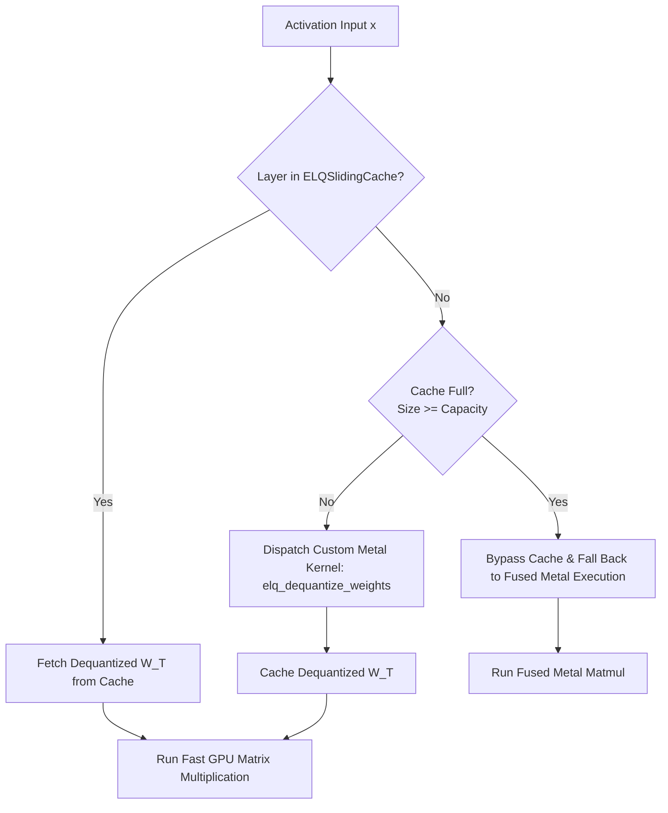

# Deep Dive: Embedding Lattice Quantization (ELQ)

## 1. The Core Problem: Why Standard 4-bit Quantization Degrades LLMs
Standard 4-bit quantization methods (like uniform integer quantization in GGUF or weight-only AWQ) scale and quantize all weights uniformly. However, LLMs (especially models like Gemma-4) contain **outlier activations**—sparse, high-magnitude channels that carry critical reasoning and syntactic information. 
When these outliers are quantized into a tight 4-bit range, their values are clipped or heavily rounded, causing severe accuracy collapse (word salad, syntax breakdown in regex, etc.).

---

## 2. The ELQ Solution: Split-Coordinate Quantization
Embedding Lattice Quantization (ELQ) solves this by splitting the weight matrix $W$ into a dense quantized matrix and a sparse outlier correction matrix:

$$W = \text{Dequant}(W_{\text{quant}}) + \Delta W_{\text{outliers}}$$

### How ELQ Splits the Weights
Quantizing an LLM without breaking its brain is a delicate art. ELQ does this in a few systematic steps:
1. **Outlier Identification**: First, we use `MorseAWQCalibrator` to evaluate the weight matrix and activation distributions. It calculates a sensitivity score for each channel (using the AWQ metric: $s_c = \text{mean}(|X_c|) \times \|W_c\|_2$). The top outlier channels (e.g., 10%) are flagged.
2. **Outlier Isolation**: The high-magnitude weights in these outlier channels are extracted into a coordinate-sparse matrix $\Delta W_{\text{outliers}}$. These precious outliers are stored in their native precision (float16/bfloat16) to avoid any clipping or rounding degradation.
3. **Lattice Projection**: The remaining non-outlier weights (with outlier channels zeroed out) are rotated block-by-block (using blocks of size 32) via a deterministic sign-flip and a Walsh-Hadamard Transform (WHT). This mathematical "spin cycle" distributes coordinate energy evenly, preventing any single dimension from hogging the dynamic range.
4. **E8 Encoding**: The rotated 32D blocks are sliced into 8-dimensional sub-vectors and projected onto the closest point in the 8D $E_8$ lattice using the Conway-Sloane closest-point algorithm. The resulting coordinates are packed into a tidy 32-bit index.

### Under the Hood: The Parameters
In `qan_transformers/mlx/modeling.py`, an `ELQLinear` layer stores:
1.  `self._indices`: 4-bit quantized indices mapping weights onto E8 coordinate lattices.
2.  `self._scales`: Block-wise scaling factors to decompress the indices.
3.  `self._outliers` & `self._outlier_indices`: A coordinate-sparse matrix containing the exact, unquantized values of high-magnitude outlier weights.

---

## 3. The ELQ Sliding Cache (`ELQSlidingCache`)
Instead of keeping the entire model decompressed in RAM (which would exceed Macbook memory boundaries) or dequantizing weights on *every single forward pass* (which introduces heavy GPU dispatch overhead), ELQ utilizes a **sliding cache gateway**:



### The First-Come, First-Served Caching Protocol
*   The `ELQSlidingCache` manages a globally configurable capacity (e.g., **48 layers**).
*   During inference, layers are cached on their first forward pass. If a layer is requested and isn't cached yet, the cache checks if it has reached its capacity.
*   If the cache has room, it lazy-loads the custom Metal shader `elq_dequantize_weights` to reconstruct the full weight matrix on the fly, caches it in VRAM, and returns it.
*   If the cache is already at capacity, it does **not** perform expensive dynamic LRU eviction during inference. Paging memory and tracking cache ages on the fly would kill token generation speed and trigger JIT compiler tantrums. Instead, it operates on a first-come-first-served (FCFS) or pre-grafted static basis: any layers beyond the capacity bypass the cache entirely and fall back to fused Metal execution.

---

## 4. Fused Metal Matmul Fallback
When the cache is globally bypassed (e.g., during fast draft steps where compiling/caching is not worth the latency) or when the cache is at capacity, `ELQLinear` falls back to **fused Metal execution**:

$$\text{Out} = \text{elq\_fused\_matmul}(x, \text{indices}, \text{scales}) + x_{\text{outliers}} \Delta W_{\text{outliers, active}}^T$$

### The Fused Advantage
*   `elq_fused_matmul` performs the **dequantization and matrix multiplication in a single GPU kernel dispatch pass**.
*   It decodes the 4-bit weights on the fly inside the GPU register file *during* the multiplication, completely avoiding allocating a large temporary float32 weight matrix in RAM.
*   Outliers are added as a residual step: the input vector $x$ is sliced at the outlier coordinates ($x_{\text{outliers}}$), multiplied by the active sparse outliers matrix ($\Delta W_{\text{outliers, active}}^T$), and added to the output.

---

## 5. Technical Comparison: ELQ vs. Standard Quantization

| Spec | Standard GGUF / AWQ | ELQ (Embedding Lattice Quantization) |
| :--- | :--- | :--- |
| **Quantization Logic** | Uniform integer scaling across blocks. | Split-coordinate projection: E8-mapped indices + sparse outliers. |
| **Outlier Handling** | Clipped or rounded, causing accuracy drift. | Retained in native precision (fp16/bf16), preserving baseline accuracy. |
| **Memory Allocation** | Decompresses weights per forward pass or locks all in VRAM. | Pre-grafted or first-come-first-served static cache up to capacity. |
| **Metal Dispatch** | Standard batch GEMM operations. | Fused matmul fallback (zero-allocation dequant + multiplication in registers). |

---

## 6. Gated Feedforward Networks (FFN) and ELQ
Modern LLMs like Gemma feature gated feedforward network (FFN) layers (using GeGLU activation), which are split into `gate_proj`, `up_proj`, and `down_proj`.

### The Fusion Dilemma
In a standard unquantized model, `gate_proj` and `up_proj` can be concatenated along the output feature dimension to create a single fused weight matrix $W_{\text{gate\_up}}$. This allows the model to compute both projections in a single, highly-optimized matrix multiplication (`x @ W_gate_up.T`), improving GPU utilization.

However, attempting this weight-level fusion with ELQ-quantized layers is a recipe for disaster:
1. **Coordinate Remapping Nightmare**: Concatenating weight matrices would destroy the block-wise structure of the E8-lattice indices.
2. **Outlier Collision**: The outlier channel indices for `gate_proj` and `up_proj` are completely different. Forcing them into a single fused coordinate space would require a messy re-indexing step and cause significant accuracy degradation.

### The ELQ Solution
To avoid these issues, `FusedGeGLUFFN` (found in `qan_transformers/mlx/moonshots.py`) handles `ELQLinear` projections by keeping `gate_proj` and `up_proj` as **separate module calls**. 
While standard linear layers get compiled into a single fused weight matrix multiplication, ELQ layers run their independent forward passes and are combined in the compiled execution graph:
```python
@mx.compile
def _module_forward(x):
    gate = self.gate_proj(x)
    up = self.up_proj(x)
    activated = self.gelu(gate) * up
    return self.down_proj(activated)
```
This preserves the exact E8 lattice mappings and isolated outlier matrices for both projections, ensuring zero accuracy degradation while still benefiting from MLX's graph compilation.
