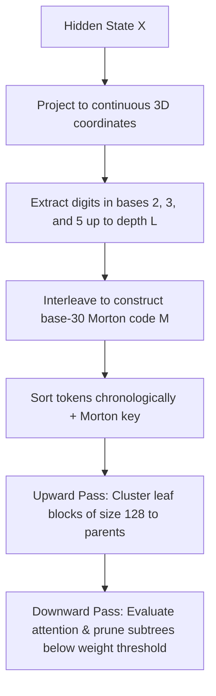

# Mathematical Specifications & Derivations

This document provides a mathematically rigorous formulation and derivation of the core algorithms implemented in **Project Atlas (QAN-ATLAS)**. We promise it contains 100% genuine linear algebra, some non-Archimedean topology, and 0% marketing fluff.

---

## 1. Concentric Icosian Shell Mapping ($E_8$ Projection)

The standard $E_8$ Gosset root lattice contains 240 root vectors in $\mathbb{R}^8$ at norm squared equal to $2$. These roots are projected into $\mathbb{R}^3$ to create a coordinate-sparse attention grid while preserving icosahedral rotational and inversion symmetries.

Think of the $E_8$ lattice as an 8-dimensional disco ball with 240 perfect vertices. Since we live in a 3D world (and GPUs prefer three coordinates to eight), we need to squash this 8D ball into a 3D space without losing its symmetry. We do this by projecting the 8D space to 4D using the golden ratio $\phi$, and then dropping one coordinate to land in 3D. The result is 240 points clustered into 5 nested concentric shells—like layers of an astronomical onion.

### 1.1 The Golden Ratio Projection
The projection matrix $P \in \mathbb{R}^{8 \times 3}$ is constructed as a product of two projections:

$$
P = P_{8 \to 4} \cdot P_{4 \to 3}
$$

where $P_{8 \to 4} \in \mathbb{R}^{8 \times 4}$ maps the 8D space into a 4D space using the golden ratio $\phi = \frac{1+\sqrt{5}}{2}$ to embed the icosahedral symmetries, scaled by $s = \frac{1}{\sqrt{1 + \phi^2}}$:

$$
P_{8 \to 4} = s \begin{bmatrix} 
\phi & 0 & 0 & 0 \\
0 & \phi & 0 & 0 \\
0 & 0 & \phi & 0 \\
0 & 0 & 0 & \phi \\
1 & 0 & 0 & 0 \\
0 & 1 & 0 & 0 \\
0 & 0 & 1 & 0 \\
0 & 0 & 0 & 1 
\end{bmatrix}
$$

and $P_{4 \to 3} \in \mathbb{R}^{4 \times 3}$ projects the 4D space into 3D by dropping the first coordinate:

$$
P_{4 \to 3} = \begin{bmatrix} 
0 & 0 & 0 \\
1 & 0 & 0 \\
0 & 1 & 0 \\
0 & 0 & 1 
\end{bmatrix}
$$

### 1.2 Concentration of Shells
When the 240 root coordinates $X_{E8} \in \mathbb{R}^{240 \times 8}$ are projected via $Y = X_{E8} \cdot P$, their Euclidean norms $\|y_i\|_2$ cluster into exactly 5 discrete shells:
*   **Shell 0**: $r = 0.0$ (2 points)
*   **Shell 1**: $r = \frac{1}{2}\sqrt{10 - 2\sqrt{5}} \approx 0.5878$ (30 points)
*   **Shell 2**: $r = \frac{\sqrt{3}}{2} \approx 0.8660$ (64 points)
*   **Shell 3**: $r = \frac{1}{2}\sqrt{10 + 2\sqrt{5}} \approx 0.9511$ (64 points)
*   **Shell 4**: $r = 1.0$ (80 points)

*Code Reference*: Generated dynamically in [e8_projection.py](file:///Volumes/Storage/project_atlas_unified/qan_transformers/math/e8_projection.py#L7-L98) (`generate_dynamic_e8_coordinates`).

### 1.3 The Leech Lattice $\Lambda_{24}$ Projection
To scale the addressable coordinates for extremely long context windows, the system supports replacing the 8D $E_8$ lattice with the 24D Leech lattice $\Lambda_{24}$. The Leech lattice contains **196,560** vectors in its first shell (norm squared equal to 4), generated via the binary Golay code $C_{24}$ [24, 12, 8].

To map the 24D coordinates into a 3D quasicrystal grid, we construct a projection matrix $P_{24 \to 3} \in \mathbb{R}^{24 \times 3}$. We utilize two projection approaches:
1.  **Golden Cascade Projection:** Extending the Icosian golden ratio projection across 24 dimensions in three cascaded 8D blocks:
    

$$
P_{24 \to 3} = \begin{bmatrix} P_{8 \to 3} \\ P_{8 \to 3} \cdot R_1 \\ P_{8 \to 3} \cdot R_2 \end{bmatrix}
$$

    where $R_1, R_2 \in \mathbb{R}^{3 \times 3}$ are deterministic icosahedral rotation matrices to prevent coordinate overlap.
2.  **Direct Orthogonal Projection:** Computing a projection that maps 24D points into 3D while maximizing representation quality:
    

$$
\text{quality} = \frac{1}{N}\sum_{i=1}^N \frac{\|\mathbf{y}_i\|_2}{\|\mathbf{x}_i\|_2}
$$

    where $\mathbf{y}_i = \mathbf{x}_i \cdot P_{24 \to 3}$. This direct method concentrates the 196,560 projected vectors into **8 discrete concentric shells** with an alignment quality score of $\approx 0.73$.

*Code Reference*: Golay coding and Leech coordinates are generated in [leech_lattice.py](file:///Volumes/Storage/project_atlas_moonshot/qan_transformers/math/leech_lattice.py) (`generate_leech_coordinates`, `project_leech_to_3d`).

---

## 2. p-Adic Tree Coordinate Routing & E8 Integration (UCE)

The **Ultrametric Cognitive Engine (UCE)** imposes a tree structure over the continuous attention space to enable efficient routing and sequence sorting.

### 2.1 continuous-to-p-adic Mapping
The input hidden state $X \in \mathbb{R}^{B \times S \times D}$ is projected into continuous coordinates $\mathbf{c} \in (0,1)^3$:

$$
\mathbf{z} = X W_c + b_c, \quad W_c \in \mathbb{R}^{D \times 3}, \quad b_c \in \mathbb{R}^3
$$

$$
\mathbf{c} = \sigma(\mathbf{z})
$$

To build an ultrametric tree, we extract digits $d_{i, k}$ at depth levels $k \in \{1, 2, \dots, \text{depth}\}$ using prime bases $p_0=2$, $p_1=3$, and $p_2=5$ (corresponding to prime factors of base-30).
Let $r_i^{(0)} = c_i$. For each depth level $k$:

$$
d_{i, k} = \lfloor r_i^{(k-1)} \cdot p_i \rfloor
$$

$$
d_{i, k} = \text{clamp}(d_{i, k}, 0, p_i - 1)
$$

$$
r_i^{(k)} = r_i^{(k-1)} \cdot p_i - d_{i, k}
$$

These base-$p_i$ digits are interleaved at each level $k$ to yield a base-30 Morton code index:

$$
d_{30, k} = d_{0, k} + 2 d_{1, k} + 6 d_{2, k}
$$

$$
M(X) = \sum_{k=1}^{\text{depth}} d_{30, k} \cdot 30^{\text{depth} - k}
$$

The Morton code $M(X)$ uniquely positions the token within a hierarchical $p$-adic tree.

### 2.2 2-Adic Database Pruning
To retrieve stored KV states without brute-force searching the entire E8 coordinate-sparse database, the query's quantized coordinate $\mathbf{x}_{\text{quant}} \in \mathbb{R}^8$ is expanded using the 240 Shell 1 roots $\mathbf{r}_j$:

$$
\mathbf{x}_{\text{cand}, j} = \mathbf{x}_{\text{quant}} + \mathbf{r}_j
$$

We map coordinates $\mathbf{x} \in \mathbb{R}^8$ to dyadic coset representatives $\mathbb{F}_2^8$ at level 1:

$$
\mathbf{y} = \lfloor 2 \mathbf{x} \rceil \pmod 2 \in \{0, 1\}^8
$$

This dyadic coset is packed into an 8-bit integer coset ID:

$$
\text{Coset}(\mathbf{x}) = \sum_{n=0}^{7} y_n \cdot 2^n
$$

The database lookup is pruned to candidates matching the query's candidate cosets:

$$
\text{Coset}(\mathbf{x}_{\text{db}}) \in \{ \text{Coset}(\mathbf{x}_{\text{cand}, j}) \}_j
$$

*Code Reference*: Digit extraction and Morton coding are implemented in [attention.py](file:///Volumes/Storage/project_atlas_unified/qan_transformers/modeling/attention.py#L1045-L1089) (`UltrametricAttention.forward`). The 2-adic database lookup pruning is implemented in [e8_swap.py](file:///Volumes/Storage/project_atlas_unified/qan_transformers/math/e8_swap.py#L761-L818) (`AdelicMemorySwapGridDB._swap_in`).

### 2.3 Conway-Sloane E8 Lattice Decoding
But wait, how do we find which of these $E_8$ coordinates is closest to a given high-dimensional activation? We use the Conway-Sloane closest-point $E_8$ sphere decoding algorithm. Standard nearest-neighbor searches are notoriously lazy and slow. Conway and Sloane realized we could find the closest point in the $E_8$ lattice without checking all points, by treating $E_8$ as the union of two simpler lattices: the checkerboard lattice $D_8$ and its half-integer coset $D_8 + \frac{1}{2}\mathbf{1}$.

Mathematically, for any point $x \in \mathbb{R}^8$:

$$
\text{Closest}_{E_8}(x) = \mathop{\text{argmin}}_{z \in D_8 \cup (D_8 + \frac{1}{2}\mathbf{1})} \|x - z\|^2
$$

where $D_8$ is the checkerboard lattice consisting of all integer vectors with an even coordinate sum:

$$
D_8 = \left\{ y \in \mathbb{Z}^8 \;\middle|\; \sum_{i=1}^8 y_i \equiv 0 \pmod 2 \right\}
$$

To find the closest point in $D_8$ for any vector $v \in \mathbb{R}^8$:
1. Round each coordinate of $v$ to the nearest integer: $y_i = \lfloor v_i \rceil$.
2. Sum them up: $S_y = \sum_{i=1}^8 y_i$. If this sum is even, congratulations! $y$ is in $D_8$ and we are done.
3. If the sum is odd, we have a parity crisis. To fix it, find the coordinate $k$ that had the largest rounding error: $k = \mathop{\text{argmax}}_i |v_i - y_i|$. Then shift $y_k$ by $+1$ or $-1$ (in the direction of the original value $v_k$) to flip the parity back to even.

We perform this decode on both $x$ (yielding candidate $f$) and $x - \frac{1}{2}\mathbf{1}$ (yielding candidate $g$ after adding back $\frac{1}{2}\mathbf{1}$), and then keep whichever candidate sits closer to $x$.

*Code Reference*: Vectorized Conway-Sloane E8 decoding is implemented in [e8_projection.py](file:///Volumes/Storage/project_atlas_unified/qan_transformers/math/e8_projection.py#L100-L191) (`ConwaySloaneE8Decoder`).

---

## 3. Closed-Form Orthogonal Procrustes Alignment

To align key-value representations between draft and target models (e.g., Gemma 2B and Gemma 9B) without gradient descent, we solve the orthogonal Procrustes problem. Aligning hidden states between two different AI models usually requires hours of gradient descent and a lot of carbon emissions. Procrustes alignment does this in a single, closed-form SVD step.

### 3.1 Derivation
Given centered source hidden states $A \in \mathbb{R}^{N \times D_1}$ and centered target hidden states $B \in \mathbb{R}^{N \times D_2}$:

$$
A = X_{\text{src}} - \mu_{\text{src}}, \quad B = X_{\text{tgt}} - \mu_{\text{tgt}}
$$

We seek an orthogonal alignment matrix $M_{\text{align}} \in \mathbb{R}^{D_1 \times D_2}$ that minimizes the Frobenius norm of the mapping error:

$$
\min_{M^T M = I} \| A M - B \|_F^2
$$

Expanding the Frobenius norm:

$$
\| A M - B \|_F^2 = \text{Tr}((AM - B)^T(AM - B)) = \text{Tr}(M^T A^T A M) - 2\text{Tr}(M^T A^T B) + \text{Tr}(B^T B)
$$

Since $M$ is orthogonal, $\text{Tr}(M^T A^T A M) = \text{Tr}(A^T A)$, which is constant. Minimizing the error is equivalent to maximizing:

$$
\max_{M^T M = I} \text{Tr}(M^T A^T B)
$$

Compute the Singular Value Decomposition (SVD) of the cross-covariance matrix $C = A^T B \in \mathbb{R}^{D_1 \times D_2}$:

$$
C = U \Sigma V^T
$$

Substituting into the trace term:

$$
\text{Tr}(M^T A^T B) = \text{Tr}(M^T U \Sigma V^T) = \text{Tr}(V^T M^T U \Sigma)
$$

Let $Z = V^T M^T U$. Since $U, V, M$ are orthogonal, $Z$ is also orthogonal, meaning its diagonal elements satisfy $z_{ii} \le 1$. Because $\Sigma$ is diagonal with non-negative singular values $\sigma_i \ge 0$:

$$
\text{Tr}(Z \Sigma) = \sum_i z_{ii} \sigma_i \le \sum_i \sigma_i
$$

Equality is achieved if and only if $Z = I$, which implies:

$$
V^T M^T U = I \implies M^T = V U^T \implies M_{\text{align}} = U V^T
$$

*Code Reference*: Implemented in [procrustes.py](file:///Volumes/Storage/project_atlas_unified/qan_transformers/math/procrustes.py#L6-L49) (`compute_procrustes_alignment`).

---

## 4. Woodbury-Optimized Cayley Layer Adapters

To bind multiple layers to a single swap database without VRAM blowouts, each layer uses a residual adapter $W_L = I + AB^T$ ($A, B \in \mathbb{R}^{D \times r}$) that preserves relative distances.

### 4.1 Skew-Symmetric Cayley Mapping
To guarantee that the adapter is strictly orthogonal ($W_L^T W_L = I$) and does not warp distances, we parameterize it using the Cayley transform of a skew-symmetric matrix $S$:

$$
W_L = (I - S)(I + S)^{-1}
$$

To enforce low-rank structure (rank $2r$), we construct $S$ using factor matrices $A, B \in \mathbb{R}^{D \times r}$ ($r=16$):

$$
S = AB^T - BA^T
$$

Since $S^T = (AB^T - BA^T)^T = BA^T - AB^T = -S$, $S$ is skew-symmetric by construction.

### 4.2 Woodbury Matrix Identity Optimization
Directly computing $(I + S)^{-1}$ involves inverting a $D \times D$ matrix, which has $O(D^3)$ computational complexity. For $D=2048$, this is too slow for real-time inference. We optimize this using the Woodbury matrix identity:

$$
(I_D + U V^T)^{-1} = I_D - U(I_{2r} + V^T U)^{-1} V^T
$$

We rewrite the skew-symmetric matrix $S = AB^T - BA^T$ as a product of two low-rank matrices $U, V \in \mathbb{R}^{D \times 2r}$:

$$
U = [A \mid -B], \quad V = [B \mid A]
$$

Checking the product:

$$
U V^T = \begin{bmatrix} A & -B \end{bmatrix} \begin{bmatrix} B^T \\ A^T \end{bmatrix} = AB^T - BA^T = S
$$

We substitute this factorization into the Cayley transform:

$$
W_L = (I_D - U V^T)(I_D + U V^T)^{-1}
$$

Applying the Woodbury identity to the inverse term:

$$
(I_D + U V^T)^{-1} = I_D - U (I_{2r} + V^T U)^{-1} V^T
$$

Now, expand the full adapter product:

$$
W_L = (I_D - U V^T) \left[ I_D - U (I_{2r} + V^T U)^{-1} V^T \right]
$$

$$
W_L = I_D - U V^T - U (I_{2r} + V^T U)^{-1} V^T + U V^T U (I_{2r} + V^T U)^{-1} V^T
$$

Factor out $U$ and $V^T$:

$$
W_L = I_D - U \left[ I_{2r} + (I_{2r} - V^T U) (I_{2r} + V^T U)^{-1} \right] V^T
$$

Let $M = V^T U \in \mathbb{R}^{2r \times 2r}$. The term inside brackets simplifies as:

$$
I_{2r} + (I_{2r} - M)(I_{2r} + M)^{-1} = (I_{2r} + M)(I_{2r} + M)^{-1} + (I_{2r} - M)(I_{2r} + M)^{-1}
$$

$$
= \left[ (I_{2r} + M) + (I_{2r} - M) \right] (I_{2r} + M)^{-1} = 2 (I_{2r} + M)^{-1}
$$

Substituting back yields the final Woodbury Cayley adapter equation:

$$
W_L = I_D - 2 U (I_{2r} + V^T U)^{-1} V^T
$$

This requires inverting a matrix of size $2r \times 2r$ ($32 \times 32$ for rank $r=16$), reducing complexity from $O(D^3)$ to $O(D \cdot r^2 + r^3)$, which is extremely fast and numerically stable.

*Code Reference*: Implemented in [attention.py](file:///Volumes/Storage/project_atlas_unified/qan_transformers/modeling/attention.py#L46-L92) (`cayley_orthogonal_adapter`).

---

## 5. Graph Laplacian & Fiedler Vector Context Bisection

The Čech Cohomology firewall calculates structural fracture boundaries in the attention matrix using Spectral Graph Theory. When a model starts printing confident gibberish, the attention matrix's connectivity collapses.

### 5.1 Symmetric Normalized Laplacian
Given the attention skeleton matrix $A_{\text{skeleton}} \in \mathbb{R}^{K \times K}$ representing interactions between the top $K$ critical summits:

$$
W = \frac{1}{2}(A_{\text{skeleton}} + A_{\text{skeleton}}^T)
$$

The diagonal degree matrix $D \in \mathbb{R}^{K \times K}$ has elements:

$$
d_{ii} = \sum_j W_{ij}
$$

The graph Laplacian $L \in \mathbb{R}^{K \times K}$ is:

$$
L = D - W
$$

The second smallest eigenvalue $\lambda_2$ of $L$ is the **algebraic connectivity** of the graph. If $\lambda_2 < \tau$, the attention graph has fractured into disconnected components (indicating potential hallucination or adversarial steering).

### 5.2 Fiedler Vector Bisection
The eigenvector $v_2$ corresponding to $\lambda_2$ is the **Fiedler vector**. The signs of $v_2$ partition the vertices into two maximally disconnected subgraphs:

$$
G_{\text{pos}} = \{ i \mid v_2[i] \ge 0 \}, \quad G_{\text{neg}} = \{ i \mid v_2[i] < 0 \}
$$

The boundary index of the split is determined by finding the boundary coordinate:

$$
\text{boundary} = \begin{cases} 
\min(G_{\text{neg}}) & \text{if } \min(G_{\text{pos}}) < \min(G_{\text{neg}}) \\
\min(G_{\text{pos}}) & \text{otherwise}
\end{cases}
$$

This boundary represents the exact sequence position where the semantic fracture occurred, allowing targeted token generation rollbacks.

### 5.3 Čech Coboundary & Cohomology Fracture Index (CFI)
To measure the exact fracture index without looping over all edges on the CPU, the firewall evaluates the Čech coboundary $d^0 s$ of the attention skeleton representation $s$:

$$
d^0 s(i, j) = s_i - W_{ij} s_j
$$

along edges where the attention weight $W_{ij} > 0.1$ and $i \neq j$.

We define a symmetric adjacency mask matrix $M \in \{0, 1\}^{K \times K}$ where $M_{ij} = 1$ if $W_{ij} > 0.1$ and $i \neq j$, and $0$ otherwise. The Cohomology Fracture Index (CFI) is the ratio of the squared norm of the coboundary to the squared norm of the state:

$$
\text{CFI} = \frac{\sum_{i \sim j} M_{ij} \|s_i - W_{ij} s_j\|^2}{\sum_{i} \|s_i\|^2}
$$

If the CFI exceeds the threshold, the firewall triggers a rollback, rewrites the fractured token, and routes the conversation down a more stable path.

*Code Reference*: Implemented in [cohomology.py](file:///Volumes/Storage/project_atlas_unified/qan_transformers/firewall/cohomology.py#L23-L247) (`check_obstruction`).

---

## 6. Adelic Langevin Optimization

To guarantee training stability on coordinate-sparse grids, weight parameters are optimized by combining continuous (Archimedean) gradients with $p$-adic tree-space leaps.

### 6.1 $p$-Adic Vladimirov Fractional Derivative
The Adelic Langevin update integrates non-Archimedean optimization. The Vladimirov fractional derivative of a function $f$ over the $p$-adic field $\mathbb{Q}_p$ is:

$$
\left(D^\alpha f\right)(x) = \frac{p^\alpha - 1}{1 - p^{-\alpha-1}} \int_{\mathbb{Q}_p} \frac{f(x) - f(y)}{\|x - y\|_p^{\alpha + 1}} dy
$$

For dyadic multiscale history compression ($\alpha = 1$, $p = 2$), the gradient updates perform discrete tunneling steps, enabling parameters to leap out of narrow local minima without loss divergence.

*Code Reference*: Implemented in [adelic.py](file:///Volumes/Storage/project_atlas_unified/qan_transformers/optim/adelic.py#L103-L308) (`AdelicLangevinOptimizer.step`).

---

## 7. Embedding Lattice Quantization (ELQ) Weight Splitting

Standard 4-bit quantization methods clip high-magnitude outlier activations, which carry reasoning and syntax information. ELQ splits the weight matrix $W$ into a dense quantized matrix and a coordinate-sparse outlier matrix:

$$
W = \text{Dequant}(W_{\text{quant}}) + \Delta W_{\text{outliers}}
$$

### 7.1 Splitting Logic
1. **Outlier Identification**: We evaluate the weight matrix and activation distributions using `MorseAWQCalibrator`. It calculates a sensitivity score for each channel using the AWQ metric:
   

$$
s_c = \text{mean}(|X_c|) \times \|W_c\|_2
$$

   The top outlier channels (e.g., 10%) are flagged.
2. **Outlier Isolation**: The high-magnitude weights in these outlier channels are isolated into a sparse matrix $\Delta W_{\text{outliers}}$ stored in native 16-bit precision (float16/bfloat16).
3. **Walsh-Hadamard Rotation**: The remaining weights (with outlier channels zeroed out) are rotated block-by-block (size 32) using a sign-flip and Walsh-Hadamard Transform (WHT) to distribute coordinate energy and prevent clipping.
4. **E8 Encoding**: The rotated blocks are sliced into 8D sub-vectors and projected onto the closest point in the $E_8$ lattice using the Conway-Sloane closest-point decoder, and packed into a 32-bit index.

### 7.2 Gate Projections and ELQLinear Interaction
Modern LLMs feature gated feedforward network (FFN) layers (e.g. GeGLU in Gemma), which are split into `gate_proj`, `up_proj`, and `down_proj`.

In standard architectures, `gate_proj` and `up_proj` can be concatenated along the output feature dimension to create a single fused weight matrix $W_{\text{gate\_up}}$, computing both projections in a single matmul.
Under ELQ, because the outlier indices and E8 block-wise rotations are highly specific to each projection layer, weight-level fusion of $W_{\text{gate}}$ and $W_{\text{up}}$ is prohibited (as it would destroy the coordinate mappings and cause outlier collisions).
Thus, ELQ keeps `gate_proj` and `up_proj` as separate module calls:

$$
\text{Gate}(x) = \text{ELQLinear}_{\text{gate}}(x)
$$

$$
\text{Up}(x) = \text{ELQLinear}_{\text{up}}(x)
$$

They are combined in the compiled graph:

$$
\text{Output}(x) = \text{ELQLinear}_{\text{down}}(\text{GELU}(\text{Gate}(x)) \odot \text{Up}(x))
$$

This avoids accuracy degradation while preserving the JIT compiled execution benefits.

*Code Reference*: Gated projections and cache execution are implemented in [modeling.py](file:///Volumes/Storage/project_atlas_unified/qan_transformers/mlx/modeling.py#L569-L720) (`ELQLinear`).

---

## 8. Discrete Morse KV Cache Contraction & Collapse

Discrete Morse Theory collapses redundant attention pathways to contract key-value states down to critical skeletons, avoiding GPU memory exhaustion at long contexts.

### 8.1 Vertex Energies
We compute row-sum vertex energies linearly $O(N)$ using summation associativity:

$$
E_i = \text{scale} \cdot K_i \cdot \left( \sum_{j=1}^N K_j \right)^T = \sum_{j=1}^N \frac{K_i \cdot K_j}{\sqrt{d}}
$$

Where $\text{scale} = \frac{1}{\sqrt{d}}$ and $d$ is the head dimension. These vertex energies are averaged across batches and heads to find shared redundancies.

### 8.2 Cosine Similarity and Retraction Decision
We compute the pairwise cosine similarity matrix $S$ between keys:

$$
S_{ij} = \frac{K_i \cdot K_j}{\| K_i \|_2 \| K_j \|_2}
$$

To find the most similar neighbor (excluding self-similarity):

$$
\mathop{\text{neighbor}}(i) = \mathop{\text{argmax}}_{j \neq i} S_{ij}
$$

A token $i$ is redundant (collapses along the discrete gradient vector field to its neighbor) if its similarity to its neighbor exceeds a threshold $\theta$ (default $0.85$), and its neighbor has higher energy than itself:

$$
\text{is\_redundant} = (S_{i, \mathop{\text{neighbor}}(i)} > \theta) \land (E_{\mathop{\text{neighbor}}(i)} > E_i) \land \neg \operatorname{is\_sink}(i)
$$

where `is_sink` protects critical attention sinks and recent context tokens. Tokens that are not redundant are **critical summits**.

### 8.3 Dynamic Cache Rebalancing
If critical summits exceed capacity $K_{\text{total}}$, we select the top-$K_{\text{total}}$ by energy. If they are fewer, we backfill slots from highest-energy redundant nodes. The selected indices are then sorted chronologically to preserve sequence order.

*Code Reference*: Implemented in [attention.py](file:///Volumes/Storage/project_atlas_unified/qan_transformers/modeling/attention.py#L936-L1010) (`_morse_collapse_cache`).
