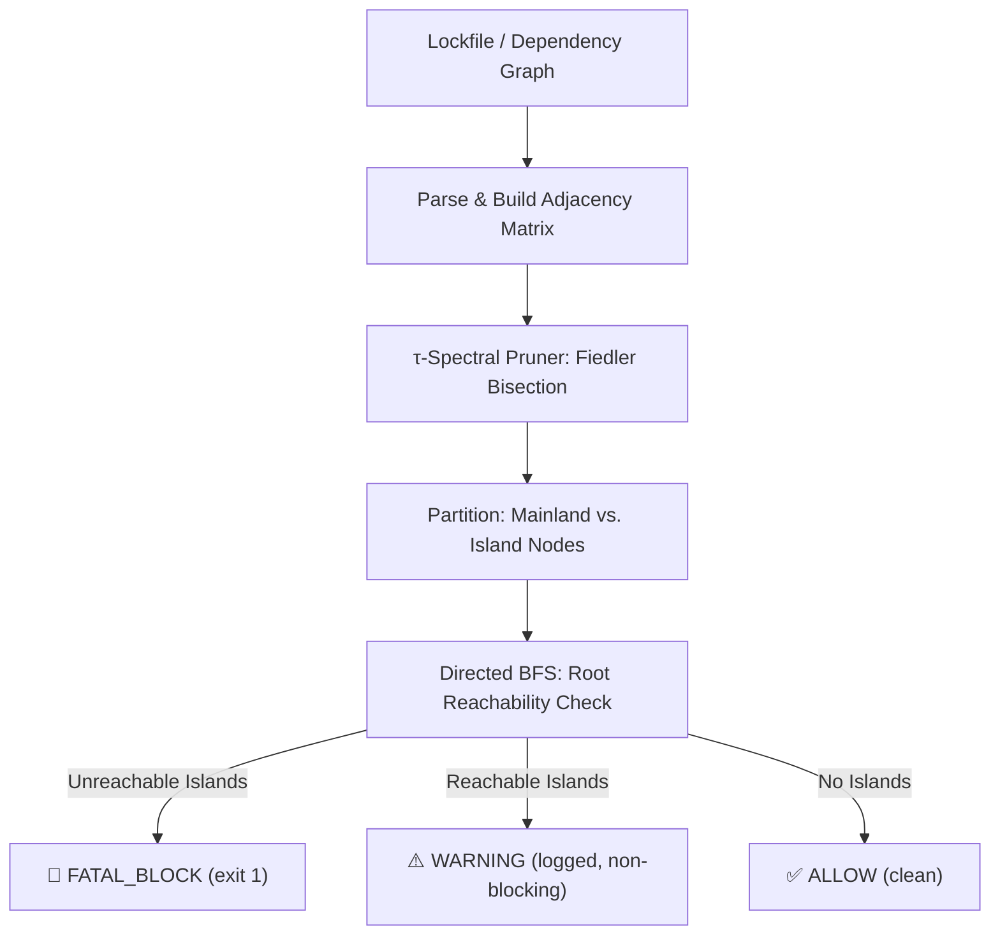

# 🛡️ τ-Gate Supply Chain Security Auditor

A lightweight Rust CLI tool that applies **Spectral Graph Theory** to audit your dependency lockfiles before installation. It builds a topological graph of your dependency tree, runs a [τ-Spectral Pruner](https://github.com/steph4n-gh/spectral-pruner) bisection analysis on the network structure, and flags structurally anomalous packages that don't belong.

Think of it as a mathematical X-ray for your `package-lock.json` and Python environments — it doesn't scan for known CVEs (that's what `npm audit` does). Instead, it detects **structural supply chain anomalies**: packages that appear in your lockfile but are topologically isolated from your actual dependency tree, or packages that form suspicious micro-clusters reaching directly into system boundaries.

---

> [!IMPORTANT]
> ### How It Works (30-Second Version)
> Every dependency graph has a natural "shape." Your project sits at the center, its direct dependencies fan out, and their transitive dependencies form a connected web. A supply chain attack injects a package that **doesn't structurally belong** — it's either completely disconnected from your real dependency tree, or it forms an isolated cluster with a suspicious bridge to system-level packages.
>
> The τ-Spectral Pruner computes the **Fiedler Vector** (the second-smallest eigenvalue \(\lambda_2\) of the graph Laplacian \(L = D - A\)) to mathematically partition your dependency graph into a **Mainland** (legitimate packages) and **Islands** (structural anomalies). A directed BFS from the project root then classifies each island node:
> * **Unreachable island** → `FATAL_BLOCK` (hard CI failure)
> * **Reachable but structurally anomalous** → `WARNING` (logged for manual review)

---

## 🏗️ Architecture



---

## 🚀 Getting Started

### Prerequisites

* **Rust** (stable toolchain) — [install via rustup](https://rustup.rs/)
* **Python 3.10+** (for Python dependency auditing only)

### Building

From the repository root:

```bash
cargo build --release --manifest-path security-auditor/Cargo.toml
```

The binary will be at `security-auditor/target/release/security-auditor`.

---

## 📋 Usage

### Auditing NPM Dependencies (package-lock.json)

```bash
# Audit the default package-lock.json in the current directory
security-auditor --lockfile package-lock.json
```

The tool parses `package-lock.json` directly, resolves nested `node_modules` dependency hierarchies, and groups packages with `hasInstallScript: true` as system boundary sinks.

### Auditing Python Dependencies

Python auditing is a two-step process — first dump the installed environment's dependency graph to JSON, then audit it:

```bash
# Step 1: Generate the dependency graph from the active virtualenv
python scripts/dump_dependencies.py \
  --root my-package-name \
  --sinks cffi,cryptography,anyio,uvicorn \
  --output python-deps.json

# Step 2: Audit the generated graph
security-auditor --graph python-deps.json
```

### Auditing Any Dependency Graph

The `--graph` mode accepts a generic JSON format, so you can audit Cargo, Go, or any ecosystem by writing a small adapter script that produces:

```json
{
  "nodes": ["my-app", "lib-a", "lib-b", "native-linker"],
  "edges": [[0, 1], [1, 2]],
  "sinks": [3],
  "system_start_idx": 3
}
```

---

## 🔍 Understanding the Verdicts

The auditor produces three possible verdicts:

| Verdict | Exit Code | Meaning |
|---------|-----------|---------|
| `ALLOW` | 0 | Dependency graph is structurally clean. No anomalies detected. |
| `WARNING` | 0 | Spectral analysis detected structurally anomalous nodes, but they are transitively reachable from the project root. Could indicate a transitive supply-chain injection — review manually. |
| `FATAL_BLOCK` | 1 | Unreachable island nodes detected. These packages exist in the lockfile but have **no transitive path** from your project root. This is the signature of dependency confusion, typosquatting, or a phantom injection attack. |

> [!WARNING]
> **`WARNING` does not mean safe.** The most sophisticated supply chain attacks (like the `event-stream` incident) inject malicious code as a transitive dependency of a legitimate package. The spectral analysis detects the structural anomaly, but since the node *is* reachable from root, it cannot hard-block without risking false positives. Treat warnings as a signal to manually review the flagged packages.

---

## ⚙️ Configuration

### Python Dependency Dumper (`dump_dependencies.py`)

| Flag | Default | Description |
|------|---------|-------------|
| `--root` | `project-atlas-unified` | The root package name to anchor the graph from. Must be installed in the active environment. |
| `--sinks` | `cffi,cryptography,anyio,uvicorn` | Comma-separated list of packages treated as system boundary sinks. These are packages that compile native code, manage network I/O, or interface with the OS — the "walls" an attacker would need to reach. |
| `-o, --output` | `python-deps.json` | Output path for the generated JSON graph. |

**Choosing your sinks:** Sinks should be packages that represent execution boundaries — native code compilers (`cffi`, `cython`), network-facing servers (`uvicorn`, `gunicorn`), cryptographic primitives (`cryptography`), or async I/O runtimes (`anyio`, `trio`). The spectral pruner checks whether any isolated cluster attempts to bridge *directly* to these boundaries, bypassing the normal dependency hierarchy.

### Pruner Thresholds

The spectral pruner is configured with the following defaults in `main.rs`:

| Parameter | Value | Description |
|-----------|-------|-------------|
| `tau` | `0.0` | Fiedler vector bisection threshold. `0.0` splits at the mathematical center of mass. |
| `threat_threshold` | `1.5` | Scale-invariant cluster density ratio above which an island is classified as a threat. |
| `momentum_beta` | `0.5` | Heavy-ball acceleration coefficient for convergence across high-diameter graphs. |

These defaults are tuned for general-purpose dependency auditing. For high-security environments, consider lowering `threat_threshold` to `1.0`.

---

## 🔬 Trade-Offs and Limitations

We believe in honest documentation. Here is what this tool **does not do**:

*   **It does not scan for known CVEs.** Use `npm audit`, `pip-audit`, or Snyk for that. This tool detects *structural* anomalies, not *known* vulnerabilities.
*   **Small graphs produce noisy results.** The Fiedler bisection mathematically partitions any connected graph with \(\ge 3\) non-sink nodes into two halves. For lockfiles with fewer than ~5 packages, this partition is a mathematical artifact, not a security signal. The tool emits a `WARNING` for these cases rather than blocking.
*   **It cannot detect malicious code inside a legitimate package.** If an attacker compromises a package you already depend on and pushes a malicious update *under the same name*, the graph topology doesn't change. Use lockfile integrity checks (hash verification) for that.
*   **Transitive injections produce warnings, not blocks.** An attacker who injects a malicious sub-dependency into a package you legitimately depend on will be flagged as `WARNING` (structurally anomalous but reachable). This is by design — hard-blocking would produce false positives on legitimate refactors.

---

## 🧪 Running Tests

```bash
cargo test --manifest-path security-auditor/Cargo.toml
```

The test suite covers:
*   **Nominal connected graphs** — must not produce `FATAL_BLOCK`.
*   **Malicious isolated nodes** — must produce `FATAL_BLOCK` with correct node identification.
*   **Transitive injection scenarios** — must produce `WARNING`, not silent `ALLOW`.
*   **Empty and single-node graphs** — edge case handling.
*   **Directed reachability correctness** — BFS traversal direction validation.

---

## 📜 License

Licensed under the Apache License, Version 2.0 — see the repository root [LICENSE](../LICENSE) for details.
